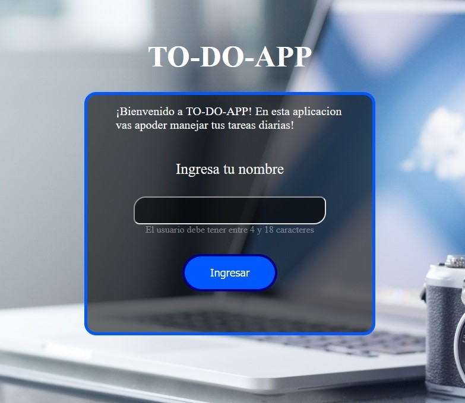

# Hi! I'm Adrian

<h2 align="center">
Developer :heart: from Argentina to :earth_americas:
</h2>

# CONTACTO:

    
    
    

# Proyectos:

## FullTask APP:

### FullTask es una pagina donde podes manejar tus tareas diarias asi poder organizar tus objetivos

##### Features: Formularios / Modal / Calendario / Redux persist / capacidad de guardar y administras tareas / capacidad de organizar las tareas / Posibilidad de eliminar tu perfil / capacidad de editar las tareas / capacidad de organizar las tareas.

    
    
    

#### Puedes verlo haciendo Click [Aqui](https://full-task.netlify.app/)

## DOGS APP:

### DOGS es una aplicación que te permite consumir la API de DOGS, crear una nueva raza de perro integrandola a la API, hacer busquedas o filtrar por diferentes parametros.

##### Features: Catalogo / Paginación / Formularios / Detalle de Producto / Busqueda / Filtrado / Ordenamiento / Consume API / Creacion de nuevas cartas

    
    
    
    

#### Puedes verlo haciendo Click [Aqui](https://apid-dogs.netlify.app/) 

# CONTACTO:

    
    
    

# AC-ARG
